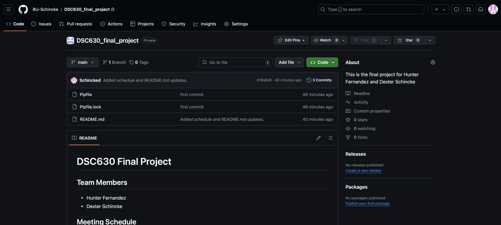
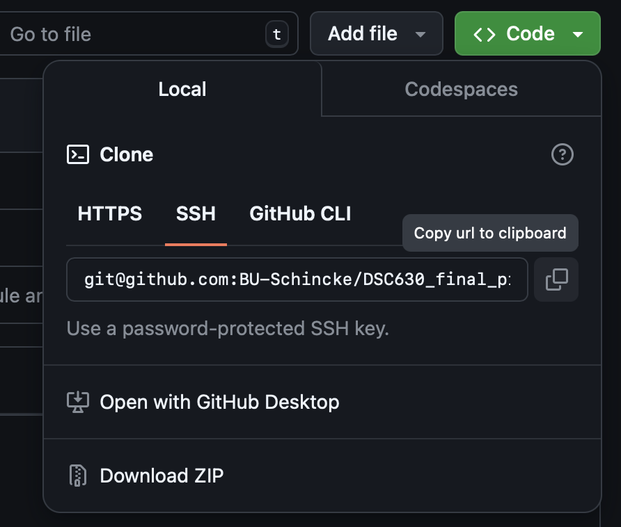
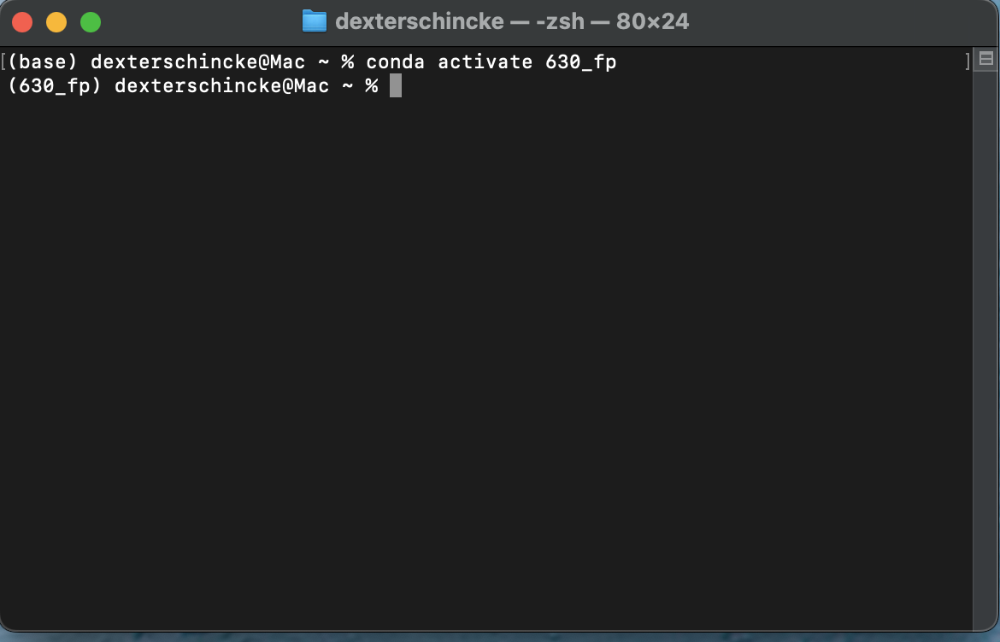

# Project Setup Instructions

## Step 1: Install Miniconda

1. Download Miniconda from the official website:
   - [Miniconda Installation](https://docs.anaconda.com/miniconda/miniconda-install/)

2. Open the downloaded package.
3. Follow the installation instructions for your operating system

## Step 2: Set Up a Conda Environment

1. After installing Miniconda, open your terminal (or Anaconda Prompt on Windows) and create a new environment:
   ```bash
   conda create -n 630_fp
2. It should now have your environment in the terminal, like the following. My environment is called 630_fp:

    
3. You need to install pip and the dependencies to conda.
    - `conda install pip`
    - type `y` to install if prompted.
4. You now have a virtual environment that you can activate by the following command.
    - `conda activate 630_fp`

## Using VS Code to clone repo
1. Navigate to the repo you have access to in the orgnaization.

2. Click the Green `<> Code` drop down menu and copy the link.

3. Create/Open the project folder in visual studio code.
4. Make sure you have git installed so you can do terminal commands.
5. Go to the terminal and type in the following command
    - `git clone <link>` (Do not include the '<>')

## Select your virtual environment in VS code
1. Type `cmd (or ctrl on windows) + shift + p` to open the settings options.
2. Search and Select `Python: Select Interpreter`.
3. Select your new anaconda environment that you made in step 2.1.
    
4. Any python file you open should now have your environment in the bottom right hand corner of the screen.
    

### Jupyter set environment.
5. When inside a jupyter notebook, a menu will pop up asking you to select your environment when you run a python cell. Select your new environment you made in 2.1.
6. Install necessary jupyter dependencies if prompted or errors.

## When installing new packages!!!
1. You want to activate your virtual environment in terminal (or anaconda prompt on windows). Here is an example using my project named 630_fp.
    - `conda activate 630_fp`
    

2. Now you can do pip installs like normal.
    - `pip install pandas`
3. Make sure you are installing packages to the environment, not <b><u>(base)</u></b>
4. As you are installing packages, add them to the repo's `requirements.txt`. This makes it clear every package is needed to run our project.

** Note **
The reason this is so helpful is that if you get a messed up package or have dependency issues, it will stay isolated to your virtual environment, not your machine's global environment.